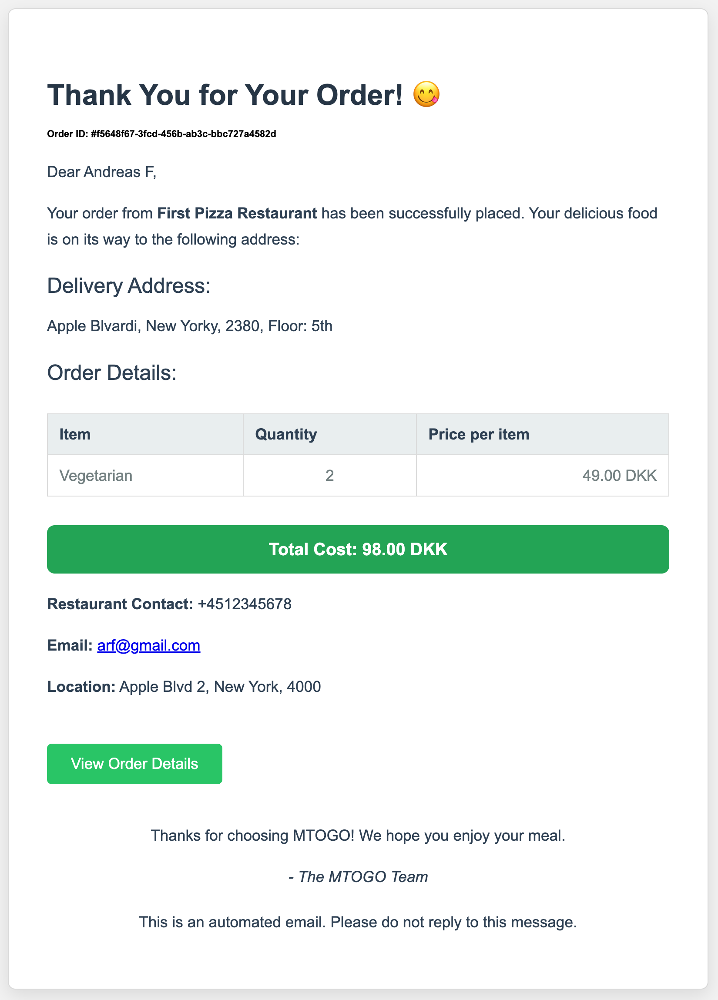
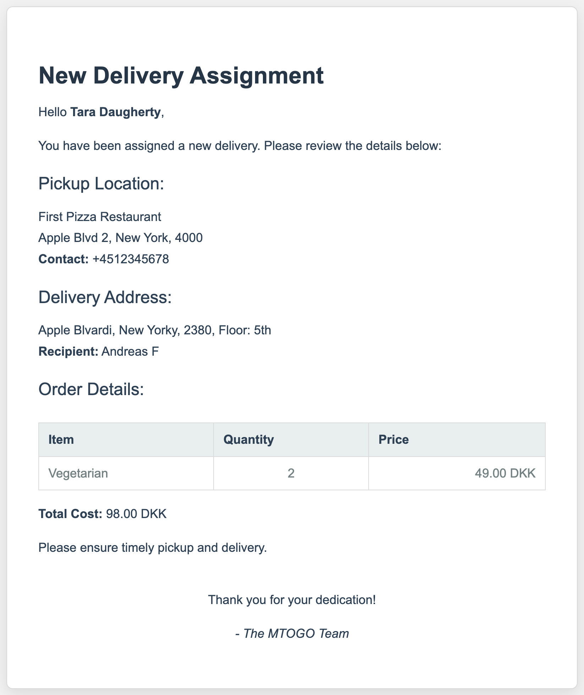
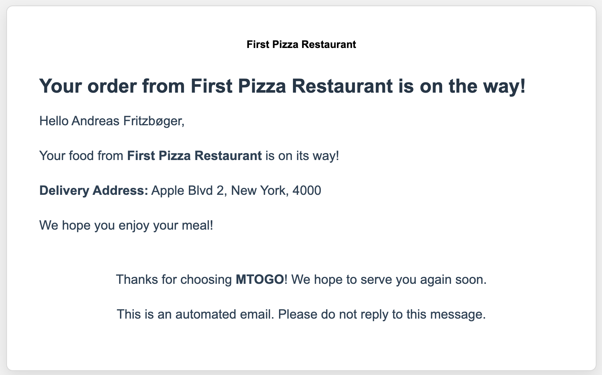
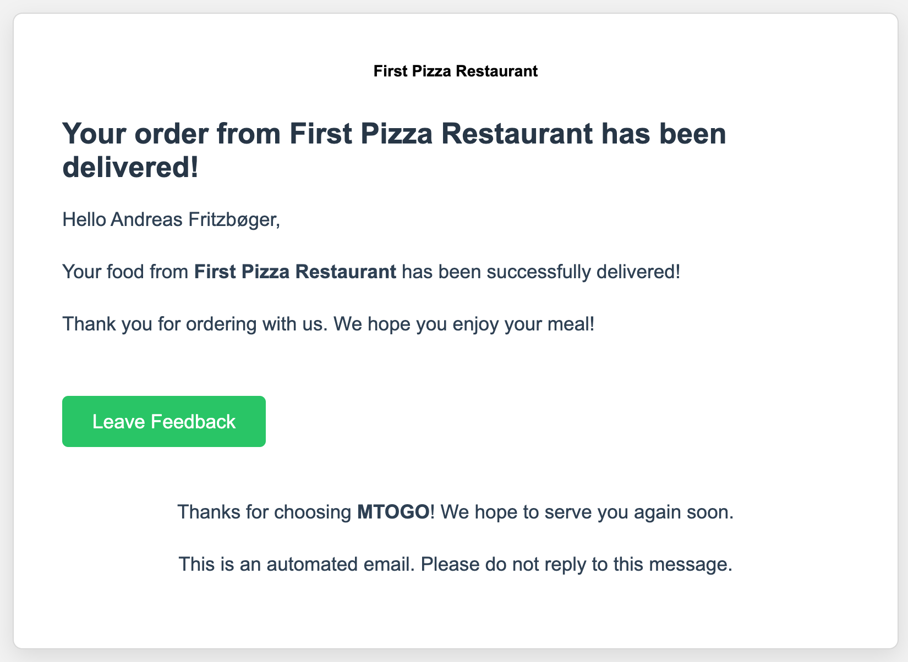
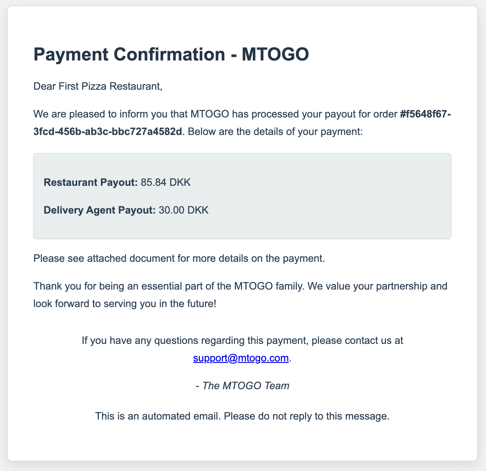
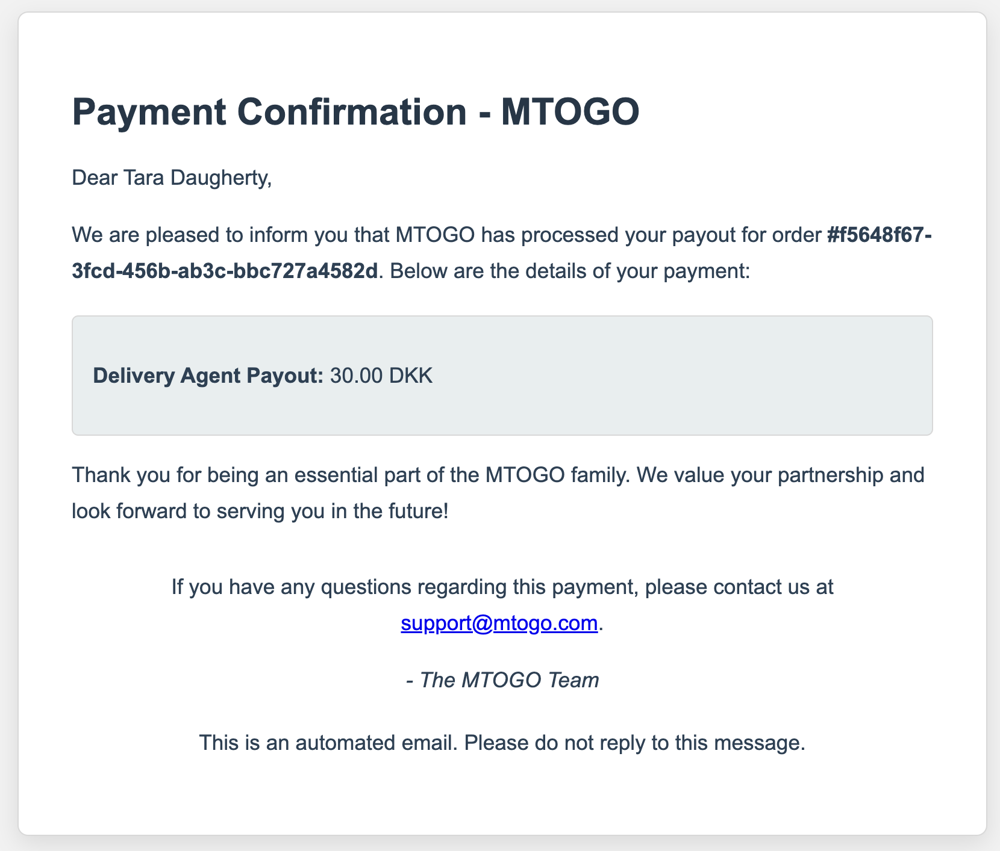

  

    
    
Order Confirmation

  

  
  

    
    
Delivery Agent Assigned

  

  
  

    
    
Customer Order On The Way

  

  
  

    
    
Customer Order Delivered

  

  
  

    
    
Payment Confirmation (Restaurant)

  

  
  

    
    
Payment Confirmation (Delivery Agent)

  

