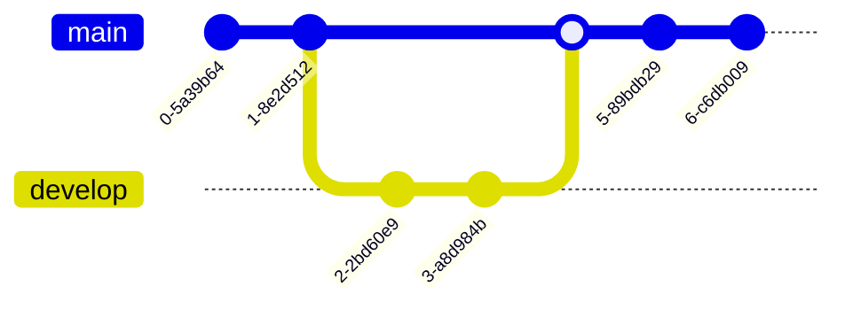

# MTOGO - Exam Repository

## Contributors

- **Andreas Fritzøger** (cph-af167@cphbusiness.dk) [GitHub](https://github.com/)
- **Owais Dashti** (cph-od42@cphusiness.dk) [GitHub](https://github.com/owaisad)

## Table of Contents

- [MTOGO - Exam Repository](#mtogo---exam-repository)
  - [Contributors](#contributors)
  - [Table of Contents](#table-of-contents)
  - [Contributors](#contributors-1)
  - [Introduction](#introduction)
  - [Setup](#setup)
  - [Microservices](#microservices)
  - [Technology Stack](#technology-stack)
  - [...](#)
  - [Development of services](#development-of-services)
  - [testing](#testing)
  - [API Documentation](#api-documentation)

## Contributors

- Andreas R. Fritzbøger: <a href = "mailto:cph-af167@cphbusiness.dk">cph-af167@cphbusiness.dk</a>
- Owais A. Dashti: <a href = "mailto:cph-od42@cphbusiness.dk">cph-od42@cphbusiness.dk</a>

## Introduction

...
Description for each exam can be found here:

- [Systems Integration](./SI/readme.md)
- [Software Quality](./SQ/readme.md)
- [Development of Large Scale Systems](./DLS/readme.md)

## Setup

...

## Microservices

list of microservices with explanation

## Technology Stack

- NestJS
- Swagger
- ...-.-.-

## ...

...

./start.sh

## Development of services

pr.yml

building

## testing

master.yml

building docker images

semantic release

## API Documentation
postman