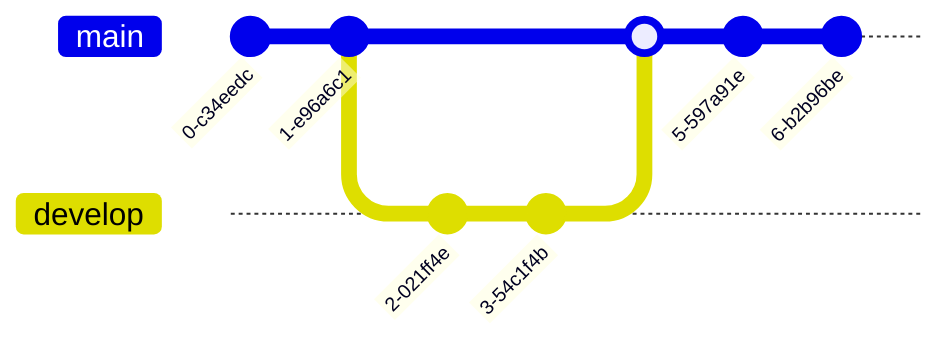

# MTOGO - Exam Repository

## **Contributors**

- **Andreas Fritzøger** (cph-af167@cphbusiness.dk) [GitHub](https://github.com/)
- **Owais Dashti** (cph-od42@cphusiness.dk) [GitHub](https://github.com/owaisad)

## Table of Contents

- [MTOGO - Exam Repository](#mtogo---exam-repository)
  - [**Contributors**](#contributors)
  - [Table of Contents](#table-of-contents)
  - [Setup project instructions](#setup-project-instructions)
  - [About](#about)
  - [Legacy system](#legacy-system)
  - [Microservices (Repositories)](#microservices-repositories)
    - [API Gateway](#api-gateway)
    - [Auth Service](#auth-service)
    - [Restaurant Service](#restaurant-service)
    - [Order Service](#order-service)
    - [Delivery Service](#delivery-service)
    - [Notification Service](#notification-service)
    - [Feedback Service](#feedback-service)
    - [MTOGO Proto Provider](#mtogo-proto-provider)
    - [MTOGO Client](#mtogo-client)
  - [Technology Stack](#technology-stack)
    - [..](#)
    - [Testing](#testing)
  - [...](#-1)
  - [Development of services](#development-of-services)
  - [Continuous Integration / Continuous Deployment (CI/CD)](#continuous-integration--continuous-deployment-cicd)
  - [API Documentation](#api-documentation)

## Setup project instructions

.env
...

## About

About the project + description for each exam..

- [Systems Integration](./SI/readme.md)
- [Software Quality](./SQ/readme.md)
- [Development of Large Scale Systems](./DLS/readme.md)

## Legacy system

strangler pattern
Repository link

## Microservices (Repositories)

list of microservices with explanation

### API Gateway

Repository link

### Auth Service

Repository link

### Restaurant Service

Repository link

### Order Service

Repository link

### Delivery Service

Repository link

### Notification Service

Repository link

### Feedback Service

Repository link

...

### MTOGO Proto Provider

Repository link

### MTOGO Client

Repository link
påbegyndt...

## Technology Stack

- Node.js + TypeScript
- Maven ...
- Express
- Jest + Supertest
- Postman
- ...-.-.-

### ..

### Testing

## ...

...

./start.sh

## Development of services

pr.yml

building

## Continuous Integration / Continuous Deployment (CI/CD)

master.yml

building docker images

semantic release

## API Documentation

postman
