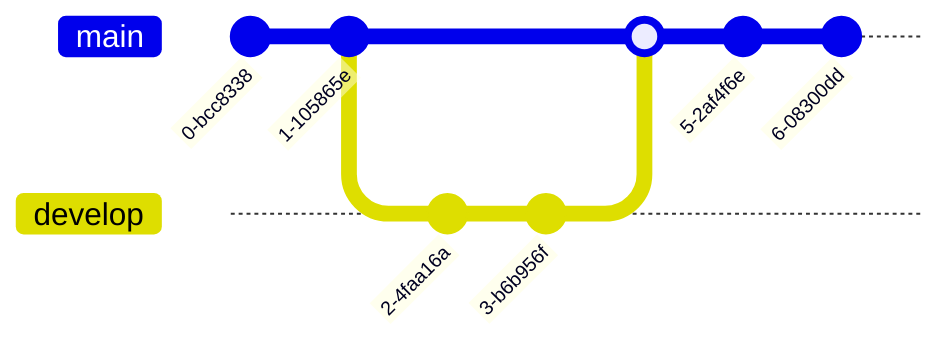

# MTOGO - Exam Repository

## Table of Contents

- [MTOGO - Exam Repository](#mtogo---exam-repository)
  - [Table of Contents](#table-of-contents)
  - [Contributors](#contributors)
  - [Introduction](#introduction)
  - [Setup](#setup)
  - [Microservices](#microservices)
  - [Technology Stack](#technology-stack)
  - [...](#)

## Contributors

- Andreas R. Fritzbøger: <a href = "mailto:cph-af167@cphbusiness.dk">cph-af167@cphbusiness.dk</a>
- Owais A. Dashti: <a href = "mailto:cph-od42@cphbusiness.dk">cph-od42@cphbusiness.dk</a>

## Introduction

...
Description for each exam can be found here:

- [Systems Integration](./SI/readme.md)
- [Software Quality](./SQ/readme.md)
- [Development of Large Scale Systems](./DLS/readme.md)

## Setup

...

## Microservices

list of microservices with explanation

## Technology Stack

- NestJS
- Swagger
- ...-.-.-

## ...

...

./start.sh
