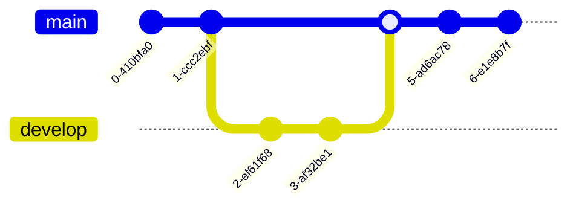

# MTOGO - Exam Repository


## Contributors

- **Andreas Fritzøger** (cph-af167@cphbusiness.dk, [GitHub](https://github.com/Wolfgang1235))
- **Owais Dashti** (cph-od42@cphbusiness.dk, [GitHub](https://github.com/owaisad))

## Table of Contents

- [MTOGO - Exam Repository](#mtogo---exam-repository)
  - [Contributors](#contributors)
  - [Table of Contents](#table-of-contents)
  - [Setup project instructions](#setup-project-instructions)
  - [About](#about)
    - [System Integration (SI)](#system-integration-si)
    - [Software Quality (SQ)](#software-quality-sq)
    - [Development of Large Systems (DLS)](#development-of-large-systems-dls)
    - [Additional Details](#additional-details)
  - [Monolithic Legacy system](#monolithic-legacy-system)
  - [Microservices-based Modern System (+ repositories)](#microservices-based-modern-system--repositories)
    - [API Gateway](#api-gateway)
    - [Auth Service](#auth-service)
    - [Restaurant Service](#restaurant-service)
    - [Order Service](#order-service)
    - [Payment Service](#payment-service)
    - [Delivery Service](#delivery-service)
    - [Notification Service](#notification-service)
    - [Feedback Service](#feedback-service)
    - [Dashboard Service](#dashboard-service)
    - [MTOGO Proto Provider](#mtogo-proto-provider)
    - [MTOGO Client](#mtogo-client)
    - [Other containers](#other-containers)
      - [Watchtower](#watchtower)
      - [Kafka UI](#kafka-ui)
  - [Technology Stack](#technology-stack)
  - [Architecture \& Design](#architecture--design)
    - [Architecture diagram](#architecture-diagram)
    - [BPMN diagram](#bpmn-diagram)
    - [Domain model](#domain-model)
    - [Domain Driven Design (DDD) models](#domain-driven-design-ddd-models)
      - [Event Storming: Step 1 - Collecting Domain Events](#event-storming-step-1---collecting-domain-events)
      - [Event Storming: Step 2 - Refining Domain Events](#event-storming-step-2---refining-domain-events)
      - [Event Storming: Step 3 - Tracking Causes](#event-storming-step-3---tracking-causes)
      - [Event Storming: Step 4 - Finding aggregates and re-sorting them](#event-storming-step-4---finding-aggregates-and-re-sorting-them)
      - [Ubiquitous Language](#ubiquitous-language)
      - [Bounded Contexts visualized in the Context Map](#bounded-contexts-visualized-in-the-context-map)
    - [C4 Model](#c4-model)
      - [Level 1 - System Context Diagram](#level-1---system-context-diagram)
      - [Level 2 - System Container Diagram](#level-2---system-container-diagram)
      - [Level 3 - Component Diagram](#level-3---component-diagram)
    - [Testing](#testing)
  - [Development of services](#development-of-services)
  - [Continuous Integration / Continuous Deployment (CI/CD)](#continuous-integration--continuous-deployment-cicd)
  - [Application Monitoring](#application-monitoring)
  - [API Documentation (Swagger OpenAPI)](#api-documentation-swagger-openapi)
  - [Docker](#docker)

## Setup project instructions

1. Clone this repository

```bash
git clone https://github.com/SoftDev2425/mtogo-exam-repo.git
cd mtogo-exam-repo
```

2. Create a `.env` file by copying the `.env.template` file:

```bash
  cp .env.template .env
```

3. Update the `.env` file with the necessary environment variables:

- `LOCATION_IQ_API_KEY` - API key for LocationIQ

  - Create an account on [LocationIQ](https://locationiq.com/). Genereate an access token in the dashboard and paste it as `LOCATION_IQ_API_KEY` in the `.env` file.

- `STRIPE_SECRET_KEY` - Secret key for Stripe

  - Sign up on [Stripe](https://stripe.com/). Go to Developers > API keys and copy the secret key. Paste it as `STRIPE_SECRET_KEY` in the `.env` file.

- `Ethereal Email Credentials` - Email credentials for sending emails
  - Sign up on [Ethereal Email](https://ethereal.email/). Copy the email and password and paste it in the `.env` file as `EMAIL_USER` and `EMAIL_PASSWORD`. This will be used to send emails and get caught by Ethereal Email.
    ```
    EMAIL_USER=<your-ethereal-email>
    EMAIL_PASSWORD=<your-ethereal-password>
    ```

4. Ensure Docker Desktop is running. Start the application by executing the following script:

```bash
./start.sh
```

This script will:

- Pull necessary Docker images.
- Build and start the containers.

Once the containers are up and running, you can access the application at `http://localhost:3000` (API Gateway).

Use Swagger to explore the API documentation at `http://localhost:3000/api-docs`.

## About

Meal To Go (MTOGO) is an advanced food delivery system designed to meet the needs of a modern, scalable, and integrated software solution for a food delivery business. The project was developed as part of the Software Development Bachelor’s Program and incorporates key learnings from the following three courses:

### System Integration (SI)

Focuses on designing and implementing an integrated software system capable of combining legacy components with modern microservices. Techniques such as the Strangler Pattern, event-driven integration, remote procedure calls and message brokering via Kafka were applied. The system integrates various independent services and ensures seamless communication through an API Gateway, promoting scalability and flexibility.

### Software Quality (SQ)

Emphasizes robust testing, quality assurance practices, and secure coding principles. The testing strategy was designed to ensure the MTOGO application handles growth from 300,000 to 1.5 million users and 3.6 million to 18 million orders over five years. Use of tools like Jest, Supertest, and Artillery for testing Node.js services, and JUnit and JMeter for Java services. Code coverage reports to ensure a minimum of 70% coverage for all services (later increased to 80%). Automated CI/CD workflows for continuous testing, code quality checks (static code analysis through ESLint), validating coding standards (Prettier) and seamless deployment. Load testing critical components like the API Gateway and microservices to simulate high user demand.

### Development of Large Systems (DLS)

Focuses on Domain-Driven Design (DDD) to align technical development with business requirements. Practices like Event Storming, creating a ubiquitous language, and defining bounded contexts guided the architecture.Architectural visualization using the C4 Model for system context, containers, and components. Implementation of branching strategies, pull requests, and automated workflows for efficient collaboration. `pr.yml` for building and testing pull requests, `master.yml` for building and deploying to production. Semantic Release for versioning and changelog generation. Docker for containerization and orchestration. API documentation using Swagger OpenAPI.

### Additional Details

Read much more in the **Design and Development Specification document**: [Design and Development Specification](https://docs.google.com/document/d/1stTdq9irwSUa2SVfKwYDESG2IQfOmqh0mN3Dapf9Sgg/edit?tab=t.0#heading=h.8n6vuq48b6vg)

## Monolithic Legacy system

strangler pattern
Repository: https://github.com/SoftDev2425/mtogo-legacy

As part of the Systems Integration exam, we were tasked with demonstrating the transition from a monolithic legacy system to a microservices-based architecture. To achieve this, we applied the Strangler Pattern, which involves incrementally replacing parts of the monolith with microservices while preserving the existing system's functionality. This approach allows for a gradual, low-risk migration that avoids disruptions in service and ensures the new architecture can be tested and integrated step-by-step. The Strangler Pattern is an effective strategy because it enables iterative development, minimizes potential downtime, and allows the team to manage change more smoothly.

Our original monolithic system was represented in the [legacy repository](https://github.com/SoftDev2425/mtogo-legacy), which showcased the foundational domains and business logic that would be modularized in the new architecture. The <a href="#domain_model">domain model</a> highlights the domains we initially mapped out in the monolithic version, serving as the basis for identifying and building out the microservices later on.

## Microservices-based Modern System (+ repositories)


### API Gateway

Repository: <a href="https://github.com/SoftDev2425/mtogo-api-gateway" target="_blank">mtogo-api-gateway</a>

The API Gateway acts as the main entry point to the MTOGO system. It handles validating sessions, routing requests to appropriate microservices, rate limiting, and proxying HTTP requests. It also includes authentication middleware and sanitizes incoming requests for security and consistency. The API Gateway is built with Node.js, Express, and TypeScript, and uses express-http-proxy for reverse proxy and routing to the appropriate microservices.

### Auth Service

Repository: <a href="https://github.com/SoftDev2425/mtogo-authservice" target="_blank">mtogo-authservice</a>

Manages users (customers, restaurants, MTOGO management) authentication and authorization. Handles user registration (storing their information), login/logout through cookie-based authentication to secure access to the system.

### Restaurant Service

Repository: <a href="https://github.com/SoftDev2425/mtogo-restaurantservice" target="_blank">mtogo-restaurantservice</a>

Allows restaurants to retrieve, create, update and delete their categories and menus within.
(WIP: It also provides endpoints for restaurants to accept or reject orders, update order status, and manage their account details.) Also allows customers to view restaurant details including their categories and menus, and add menus to their basket. This customer basket is created for each customer and restaurant combination, and is used to calculate the total order value and process the order.

### Order Service

Repository: <a href="https://github.com/SoftDev2425/mtogo-orderservice" target="_blank">mtogo-orderservice</a>

Manages the order lifecycle, from creation to delivery. It allows customers to place orders. Internally this service communicates with the restaurant service to retrieve restaurant data, customer basket and calculate the total order value. It also communicates with the payment service to process payments and the delivery service to assign delivery agents. It also handles order status updates and notifications to customers (through the notification service).

### Payment Service

Repository: <a href="https://github.com/SoftDev2425/mtogo-paymentservice" target="_blank">mtogo-paymentservice</a>

Handles customer order payment procesing and payouts to restaurant and delivery agent through Stripe. It calculates the service fee and variable order fee, deducts them from the order total, and transfers the remaining revenue to the restaurant. This service also communicates with the notification service to send payment confirmation emails to customers, restaurants and delivery agents.

### Delivery Service

Repository: <a href="https://github.com/SoftDev2425/mtogo-deliveryservice" target="_blank">mtogo-deliveryservice</a>

Handles assigning a delivery agent to an order. Produces notification event to notify the delivery agent of the order. (WIP: Handles updating the order status to "picked up" and "delivered". Currently simulated.)

### Notification Service

Repository: <a href="https://github.com/SoftDev2425/mtogo-notificationservice" target="_blank">mtogo-notificationservice</a>

Consumes events from Kafka and sends notifications (primarily emails, but capable of being extended to sms and in-app notifications as well) to customers, restaurants, and delivery agents. Notifications include order confirmations, order status updates, payment confirmations, (WIP: and feedback requests). The service uses Nodemailer to send emails that gets caught by Ethereal Email.


### Feedback Service

Repository: <a href="https://github.com/SoftDev2425/mtogo-feedbackservice" target="_blank">mtogo-feedbackservice</a>

Still a work in progess. Will collect customer feedback on orders. Includes rating and review functionality. Also communicates with the payment service to calculate bonuses for delivery agents based on customer feedback.

### Dashboard Service

Repository: <a href="https://github.com/SoftDev2425/mtogo-dashboardservice" target="_blank">mtogo-dashboardservice</a>

Still a work in progess. Will provide endpoints for a dashboard for MTOGOs management. Visualizes data like active orders, delivery times, and customer reviews.

### MTOGO Proto Provider

Repository: <a href="https://github.com/SoftDev2425/mtogo-proto-provider" target="_blank">mtogo-proto-provider</a>

A central repository for our gRPC protocol buffer definitions shared across microservices that requires it. Enhances service-to-service communication by serializing the data, which makes the communication much faster. Pushed as an [npm package](https://www.npmjs.com/package/mtogo-proto-provider) and used as a dependency.


### MTOGO Client

Repository: <a href="https://github.com/SoftDev2425/mtogo-client" target="_blank">mtogo-client</a>
SPA built with Vite React and TypeScript (available through docker at PORT XXXXXXXXXXX)

### Other containers

#### Watchtower

SHORT DESCRIPTION


#### Kafka UI

A web-based interface for managing and monitoring Kafka topics, consumers, and producers. Useful for debugging and visualizing event-driven workflows.


## Technology Stack

- Backend:
  - Most services: Node.js + TypeScript, Express, gRPC, Redis, PostgreSQL, Prisma ORM, express-gateway, express-http-proxy, Stripe, LocationIQ, Nodemailer, BullMQ, Docker, Winston for internal logging
  - Order Service: Maven + Java, Spring Boot, JPA, Hibernate, PostgreSQL, Docker
- Testing: Jest, Supertest, Postman
- Messaging: Kafka, Zookeeper, KafkaJS
- API Documentation: Postman
- CI/CD: GitHub Actions, Docker, Semantic Release, GitHub Container Registry
- Frontend: Vite React, Zod, Chakra UI, React Query, React Hook Form, Shadcn

- Node.js + TypeScript
- Maven ...
- Express
- Jest + Supertest
- Postman
- ...-.-.-

## Architecture & Design

### Architecture diagram


### BPMN diagram


### Domain model

<div id="domain_model">
  
</div>

### Domain Driven Design (DDD) models

Starting with Event Storming, we can identify the domain events and aggregate roots. This will help us to create the domain models and the C4 model. Strategic and tactical DDD will be used to design the microservices.

Strategic Design:

#### Event Storming: Step 1 - Collecting Domain Events


#### Event Storming: Step 2 - Refining Domain Events


#### Event Storming: Step 3 - Tracking Causes


#### Event Storming: Step 4 - Finding aggregates and re-sorting them


#### Ubiquitous Language

- Customer: An individual who places orders on MTOGO. Customers may create accounts to store order history and personal preferences.
- Restaurant: A food provider registered as a partner with MTOGO, offering a selection of dishes to customers through the platform.
- Menu: A list of food items provided by a restaurant, available to customers for ordering on MTOGO.
- Order: A transaction initiated by the customer to purchase food items from a restaurant through MTOGO.
- Delivery Agent: An individual/courier contracted by MTOGO to pick up orders from restaurants and deliver them to customers. Delivery agents are compensated with bonuses based on performance.
- Payment: The transaction where the customer pays for the order. MTOGO collects the payment, calculates fees, and distributes the remaining revenue to the restaurant.
- Service Fee: A recurring flat rate fee paid by the restaurant to MTOGO for using the platform.
- Variable Order Fee: A percentage fee based on the value of each order, deducted by MTOGO before paying the restaurant.
- Bonus: A payment the delivery agents received based on order value, time of working (early or late), and customer reviews.
- Feedback: An optional evaluation the customer can provide for the delivery experience, including a description and a rating from 1 to 5 stars, which may influence delivery agent bonuses.
- Notification: A push notification, SMS, or email sent to the customer each time the order’s status is updated, from preparation to delivery. Notifications also cover delays or issues with the delivery.
- Dashboard: An online management interface for MTOGO’s admin to monitor order statistics, delivery performance, customer feedback, and restaurant activity.
- Basket: An online cart where the customer can place and modify pending orders before proceeding to payment. The items are saved temporarily until checkout.
- MTOGO (Meal TO GO): A food delivery company, who operates the app, where customers can order food from restaurant’s menus.

Key Actions and Events:

- Register Restaurant: The action a restaurant takes to sign up on the MTOGO platform, becoming a partner and gaining access to customers.
- Add Menu: The action a restaurant takes to upload or update its food items on the MTOGO platform, making them visible to customers.
- Register Customer: The process by which a customer creates an account on the MTOGO platform to manage order history, preferences, and personal information.
- Log In: The action taken by a customer to access their MTOGO account.
- Place Order: The process by which a customer selects items from a restaurant's menu and submits a request to MTOGO. It is not necessary for the customer to be logged in, to place an order
- Process Payment: The interaction with an external payment gateway to collect payment from the customer for an order. MTOGO holds the payment until fees are deducted, and the remainder is transferred to the restaurant.
- Accept Order: The restaurant's action of confirming a customer's order, committing to prepare the items listed.
- Reject Order: The action taken by a restaurant to decline an order, usually due to item unavailability or excess demand.
- Prepare Order: The process the restaurant undertakes to cook and package food items for a placed order.
- Assign Delivery Agent: MTOGOs action to find an available delivery agent for an accepted and prepared order.
- Pick Up Order: The delivery agent's action of collecting the prepared order from the restaurant.
- Notify Order Status: Updates sent by MTOGO to the customer regarding the orders progress, such as preparation, pickup, transit, delivery and any delays or issues encountered.
- Deliver Order: The action taken by the delivery agent to hand over the order to the customer.
- Request Feedback: MTOGOs action of sending a prompt to the customer after delivery, asking for a review of their experience.
- Submit Feedback: The customer's response to the feedback request, including ratings and comments on the restaurant, food, and delivery experience.
- Calculate Fees: The process by which MTOGO deducts a service fee and variable order fee from the orders total revenue before transferring the remainder to the restaurant.
- Calculate and Pay Bonus: The process by which MTOGO calculates and distributes a bonus to the delivery agent, based on metrics such as order value and customer feedback.
- Update Dashboard: The action of updating the MTOGO management interface.

#### Bounded Contexts visualized in the Context Map


### C4 Model

#### Level 1 - System Context Diagram

This diagram shows the system's relationships with external entities, such as users, systems, and other external components. It provides a high-level view of how the system fits into its environment.


#### Level 2 - System Container Diagram

This diagram breaks down the system into its major containers, such as applications, services, databases, and microservices. It illustrates how these containers interact with each other and with external entities.


#### Level 3 - Component Diagram

This diagram zooms in on a specific container to show its internal components (classes, services, modules) and how they interact with each other. It provides a detailed view of a container's architecture.


### Testing

## Development of services



pr.yml

building

## Continuous Integration / Continuous Deployment (CI/CD)

master.yml
building docker images
semantic release for versioning <br>


## Application Monitoring

Coming soon:
Promehteus + Grafana

## API Documentation (Swagger OpenAPI)

When running the application in docker desktop, you can access the API documentation for each service by visiting the following URL: http://localhost:3000/api-docs


## Docker

These are the docker containers on the MTOGO platform. As a container orchestrator, we use docker compose. Our docker-compose.yml file can be found here [insert link here]
using watchtower to update containers automatically when a new image is pushed to the registry (GitHub Container Registry).
Looks for the latest image and updates the container if a new image is available.

REFORMULATE THIS

FIX THE STRUCTURE OF THE DOCKER COMPOSE BEFORE INSERTING IMAGE


