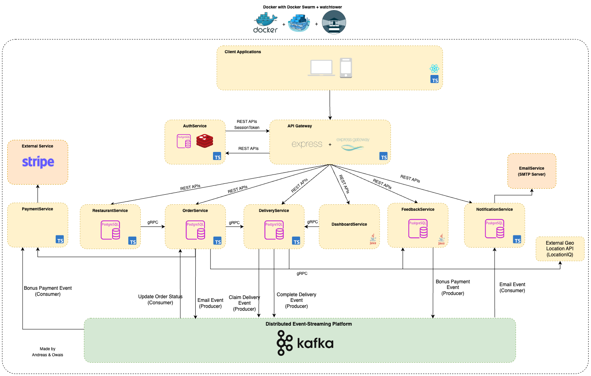

# MTOGO - Exam Repository


## Contributors

- **Andreas Fritzøger** (cph-af167@cphbusiness.dk, [GitHub](https://github.com/Wolfgang1235))
- **Owais Dashti** (cph-od42@cphusiness.dk, [GitHub](https://github.com/owaisad))

## Table of Contents

- [MTOGO - Exam Repository](#mtogo---exam-repository)
  - [Contributors](#contributors)
  - [Table of Contents](#table-of-contents)
  - [Setup project instructions](#setup-project-instructions)
  - [About](#about)
  - [Monolithic Legacy system](#monolithic-legacy-system)
  - [Microservices-based Modern System (+ repositories)](#microservices-based-modern-system--repositories)
    - [API Gateway](#api-gateway)
    - [Auth Service](#auth-service)
    - [Restaurant Service](#restaurant-service)
    - [Order Service](#order-service)
    - [Payment Service](#payment-service)
    - [Delivery Service](#delivery-service)
    - [Notification Service](#notification-service)
    - [Feedback Service](#feedback-service)
    - [Dashboard Service](#dashboard-service)
    - [MTOGO Proto Provider](#mtogo-proto-provider)
    - [MTOGO Client](#mtogo-client)
    - [Other containers](#other-containers)
      - [Kafka UI](#kafka-ui)
  - [Technology Stack](#technology-stack)
  - [Architecture \& Design](#architecture--design)
    - [Architecture diagram](#architecture-diagram)
    - [BPMN diagram](#bpmn-diagram)
    - [Domain model](#domain-model)
    - [Domain Driven Design (DDD) models](#domain-driven-design-ddd-models)
      - [Event Storming: Step 1 - Collecting Domain Events](#event-storming-step-1---collecting-domain-events)
      - [Event Storming: Step 2 - Refining Domain Events](#event-storming-step-2---refining-domain-events)
      - [Event Storming: Step 3 - Tracking Causes](#event-storming-step-3---tracking-causes)
      - [Event Storming: Step 4 - Finding aggregates and re-sorting them](#event-storming-step-4---finding-aggregates-and-re-sorting-them)
      - [Ubiquitous Language](#ubiquitous-language)
      - [Bounded Contexts visualized in the Context Map](#bounded-contexts-visualized-in-the-context-map)
    - [C4 Model](#c4-model)
      - [Level 1 - System Context Diagram](#level-1---system-context-diagram)
      - [Level 2 - System Container Diagram](#level-2---system-container-diagram)
      - [Level 3 - Component Diagram](#level-3---component-diagram)
    - [Testing](#testing)
  - [Development of services](#development-of-services)
  - [Continuous Integration / Continuous Deployment (CI/CD)](#continuous-integration--continuous-deployment-cicd)
  - [Application Monitoring](#application-monitoring)
  - [Postman API Documentation](#postman-api-documentation)
  - [Docker](#docker)

## Setup project instructions

1. Clone this repository

```bash
git clone https://github.com/SoftDev2425/mtogo-exam-repo.git
```

2. Create a `.env` file by copying the `.env.template` file:

```bash
  cp .env.template .env
```

3. Update the `.env` file with the necessary environment variables:

- `LOCATION_IQ_API_KEY` - API key for LocationIQ

  - Create an account on [LocationIQ](https://locationiq.com/). Genereate an access token in the dashboard and paste it as `LOCATION_IQ_API_KEY` in the `.env` file.

- `STRIPE_SECRET_KEY` - Secret key for Stripe

  - Sign up on [Stripe](https://stripe.com/). Go to Developers > API keys and copy the secret key. Paste it as `STRIPE_SECRET_KEY` in the `.env` file.

- `Ethereal Email Credentials` - Email address for sending emails
  - Sign up on [Ethereal Email](https://ethereal.email/). Copy the email and password and paste it in the `.env` file as `ETHEREAL_USER` and `ETHEREAL_PASSWORD`. This will be used to send emails and get caught by Ethereal Email.

4. Make sure you have Docker Desktop running. Now start the application by running the `start.sh` script:

```bash
./start.sh
```

This will take a short moment to build the Docker images and start the containers. Once the containers are up and running, you can access the application at `http://localhost:3000` (API Gateway). Use Postman collection to test the endpoints.

## About

About the project + description for each exam.....

Find out a lot more in the Design and Development Specification document: https://docs.google.com/document/d/1stTdq9irwSUa2SVfKwYDESG2IQfOmqh0mN3Dapf9Sgg/edit?tab=t.0#heading=h.8n6vuq48b6vg

## Monolithic Legacy system

strangler pattern
Repository: https://github.com/SoftDev2425/mtogo-legacy

## Microservices-based Modern System (+ repositories)



list of microservices with explanation

### API Gateway

Repository: <a href="https://github.com/SoftDev2425/mtogo-api-gateway" target="_blank">mtogo-api-gateway</a>
<br >
express gateway
rate limiting
http-proxy
auth middleware
sanitize request

### Auth Service

Repository: <a href="https://github.com/SoftDev2425/mtogo-authservice" target="_blank">mtogo-authservice</a>

### Restaurant Service

Repository: <a href="https://github.com/SoftDev2425/mtogo-restaurantservice" target="_blank">mtogo-restaurantservice</a>

### Order Service

Repository: <a href="https://github.com/SoftDev2425/mtogo-orderservice" target="_blank">mtogo-orderservice</a>

### Payment Service

Repository: <a href="https://github.com/SoftDev2425/mtogo-paymentservice" target="_blank">mtogo-paymentservice</a>

### Delivery Service

Repository: <a href="https://github.com/SoftDev2425/mtogo-deliveryservice" target="_blank">mtogo-deliveryservice</a>

### Notification Service

Repository: <a href="https://github.com/SoftDev2425/mtogo-notificationservice" target="_blank">mtogo-notificationservice</a>


### Feedback Service

Repository: <a href="https://github.com/SoftDev2425/mtogo-feedbackservice" target="_blank">mtogo-feedbackservice</a>

### Dashboard Service

Repository: <a href="https://github.com/SoftDev2425/mtogo-dashboardservice" target="_blank">mtogo-dashboardservice</a>

### MTOGO Proto Provider

Repository: <a href="https://github.com/SoftDev2425/mtogo-proto-provider" target="_blank">mtogo-proto-provider</a>
npm package for proto files for grpc

### MTOGO Client

Repository: <a href="https://github.com/SoftDev2425/mtogo-client" target="_blank">mtogo-client</a>
SPA built with Vite React and TypeScript (available through docker at PORT XXXXXXXXXXX)

### Other containers
#### Kafka UI


## Technology Stack

- Backend:
  - Most services: Node.js + TypeScript, Express, gRPC, Redis, PostgreSQL, Prisma ORM, express-gateway, express-http-proxy, Stripe, LocationIQ, Nodemailer, BullMQ, Docker, Winston for internal logging
  - Order Service: Maven + Java, Spring Boot, JPA, Hibernate, PostgreSQL, Docker
- Testing: Jest, Supertest, Postman
- Messaging: Kafka, Zookeeper, KafkaJS
- API Documentation: Postman
- CI/CD: GitHub Actions, Docker, Semantic Release, GitHub Container Registry
- Frontend: Vite React, Zod, Chakra UI, React Query, React Hook Form, Shadcn

- Node.js + TypeScript
- Maven ...
- Express
- Jest + Supertest
- Postman
- ...-.-.-

## Architecture & Design

### Architecture diagram


### BPMN diagram


### Domain model


### Domain Driven Design (DDD) models

Starting with Event Storming, we can identify the domain events and aggregate roots. This will help us to create the domain models and the C4 model. Strategic and tactical DDD will be used to design the microservices.

Strategic Design:

#### Event Storming: Step 1 - Collecting Domain Events


#### Event Storming: Step 2 - Refining Domain Events


#### Event Storming: Step 3 - Tracking Causes


#### Event Storming: Step 4 - Finding aggregates and re-sorting them


#### Ubiquitous Language

- Customer: An individual who places orders on MTOGO. Customers may create accounts to store order history and personal preferences.
- Restaurant: A food provider registered as a partner with MTOGO, offering a selection of dishes to customers through the platform.
- Menu: A list of food items provided by a restaurant, available to customers for ordering on MTOGO.
- Order: A transaction initiated by the customer to purchase food items from a restaurant through MTOGO.
- Delivery Agent: An individual/courier contracted by MTOGO to pick up orders from restaurants and deliver them to customers. Delivery agents are compensated with bonuses based on performance.
- Payment: The transaction where the customer pays for the order. MTOGO collects the payment, calculates fees, and distributes the remaining revenue to the restaurant.
- Service Fee: A recurring flat rate fee paid by the restaurant to MTOGO for using the platform.
- Variable Order Fee: A percentage fee based on the value of each order, deducted by MTOGO before paying the restaurant.
- Bonus: A payment the delivery agents received based on order value, time of working (early or late), and customer reviews.
- Feedback: An optional evaluation the customer can provide for the delivery experience, including a description and a rating from 1 to 5 stars, which may influence delivery agent bonuses.
- Notification: A push notification, SMS, or email sent to the customer each time the order’s status is updated, from preparation to delivery. Notifications also cover delays or issues with the delivery.
- Dashboard: An online management interface for MTOGO’s admin to monitor order statistics, delivery performance, customer feedback, and restaurant activity.
- Basket: An online cart where the customer can place and modify pending orders before proceeding to payment. The items are saved temporarily until checkout.
- MTOGO (Meal TO GO): A food delivery company, who operates the app, where customers can order food from restaurant’s menus.

Key Actions and Events:

- Register Restaurant: The action a restaurant takes to sign up on the MTOGO platform, becoming a partner and gaining access to customers.
- Add Menu: The action a restaurant takes to upload or update its food items on the MTOGO platform, making them visible to customers.
- Register Customer: The process by which a customer creates an account on the MTOGO platform to manage order history, preferences, and personal information.
- Log In: The action taken by a customer to access their MTOGO account.
- Place Order: The process by which a customer selects items from a restaurant's menu and submits a request to MTOGO. It is not necessary for the customer to be logged in, to place an order
- Process Payment: The interaction with an external payment gateway to collect payment from the customer for an order. MTOGO holds the payment until fees are deducted, and the remainder is transferred to the restaurant.
- Accept Order: The restaurant's action of confirming a customer's order, committing to prepare the items listed.
- Reject Order: The action taken by a restaurant to decline an order, usually due to item unavailability or excess demand.
- Prepare Order: The process the restaurant undertakes to cook and package food items for a placed order.
- Assign Delivery Agent: MTOGOs action to find an available delivery agent for an accepted and prepared order.
- Pick Up Order: The delivery agent's action of collecting the prepared order from the restaurant.
- Notify Order Status: Updates sent by MTOGO to the customer regarding the orders progress, such as preparation, pickup, transit, delivery and any delays or issues encountered.
- Deliver Order: The action taken by the delivery agent to hand over the order to the customer.
- Request Feedback: MTOGOs action of sending a prompt to the customer after delivery, asking for a review of their experience.
- Submit Feedback: The customer's response to the feedback request, including ratings and comments on the restaurant, food, and delivery experience.
- Calculate Fees: The process by which MTOGO deducts a service fee and variable order fee from the orders total revenue before transferring the remainder to the restaurant.
- Calculate and Pay Bonus: The process by which MTOGO calculates and distributes a bonus to the delivery agent, based on metrics such as order value and customer feedback.
- Update Dashboard: The action of updating the MTOGO management interface.

#### Bounded Contexts visualized in the Context Map


### C4 Model

#### Level 1 - System Context Diagram

This diagram shows the system's relationships with external entities, such as users, systems, and other external components. It provides a high-level view of how the system fits into its environment.


#### Level 2 - System Container Diagram

This diagram breaks down the system into its major containers, such as applications, services, databases, and microservices. It illustrates how these containers interact with each other and with external entities.


#### Level 3 - Component Diagram

This diagram zooms in on a specific container to show its internal components (classes, services, modules) and how they interact with each other. It provides a detailed view of a container's architecture.


### Testing

## Development of services


pr.yml

building

## Continuous Integration / Continuous Deployment (CI/CD)

master.yml
building docker images
semantic release for versioning <br>


## Application Monitoring

Coming soon:
Promehteus + Grafana

## Postman API Documentation

INSERT POSTMAN COLLECTION HERE + IMAGES

## Docker

These are the docker containers on the MTOGO platform. As a container orchestrator, we use docker compose. Our docker-compose.yml file can be found here [insert link here]
using watchtower to update containers automatically when a new image is pushed to the registry (GitHub Container Registry).
Looks for the latest image and updates the container if a new image is available.

REFORMULATE THIS

FIX THE STRUCTURE OF THE DOCKER COMPOSE BEFORE INSERTING IMAGE


